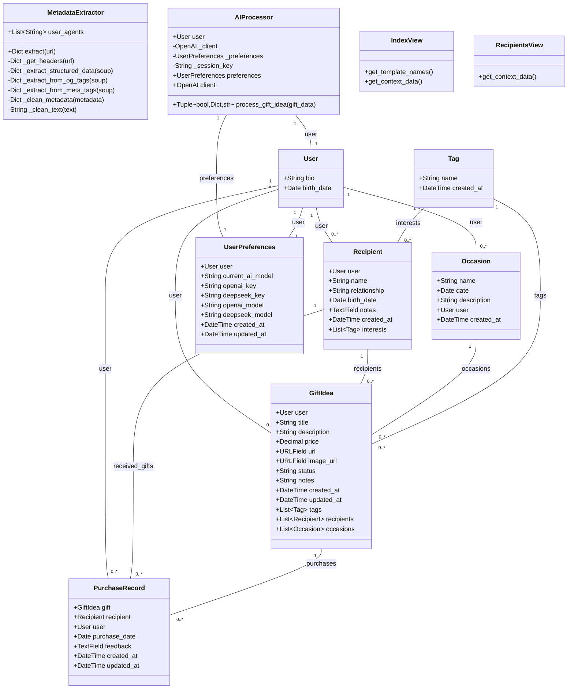

```mermaid
classDiagram
    class Tag {
        +String name
        +DateTime created_at
    }
    
    class Occasion {
        +String name
        +Date date
        +String description
        +User user
        +DateTime created_at
    }
    
    class Recipient {
        +User user
        +String name
        +String relationship
        +Date birth_date
        +TextField notes
        +DateTime created_at
        +List~Tag~ interests
    }
    
    class GiftIdea {
        +User user
        +String title
        +String description
        +Decimal price
        +URLField url
        +URLField image_url
        +String status
        +String notes
        +DateTime created_at
        +DateTime updated_at
        +List~Tag~ tags
        +List~Recipient~ recipients
        +List~Occasion~ occasions
    }
    
    class UserPreferences {
        +User user
        +String current_ai_model
        +String openai_key
        +String deepseek_key
        +String openai_model
        +String deepseek_model
        +DateTime created_at
        +DateTime updated_at
    }
    
    class PurchaseRecord {
        +GiftIdea gift
        +Recipient recipient
        +User user
        +Date purchase_date
        +TextField feedback
        +DateTime created_at
        +DateTime updated_at
    }
    
    class User {
        +String bio
        +Date birth_date
    }

    class MetadataExtractor {
        +List~String~ user_agents
        +Dict extract(url)
        -Dict _get_headers(url)
        -Dict _extract_structured_data(soup)
        -Dict _extract_from_og_tags(soup)
        -Dict _extract_from_meta_tags(soup)
        -Dict _clean_metadata(metadata)
        -String _clean_text(text)
    }

    class AIProcessor {
        +User user
        -OpenAI _client
        -UserPreferences _preferences
        -String _session_key
        +UserPreferences preferences
        +OpenAI client
        +Tuple~bool,Dict,str~ process_gift_idea(gift_data)
    }

    class IndexView {
        +get_template_names()
        +get_context_data()
    }

    class RecipientsView {
        +get_context_data()
    }

    Tag "1" -- "0..*" GiftIdea : tags
    Tag "1" -- "0..*" Recipient : interests
    Occasion "1" -- "0..*" GiftIdea : occasions
    Recipient "1" -- "0..*" GiftIdea : recipients
    GiftIdea "1" -- "0..*" PurchaseRecord : purchases
    Recipient "1" -- "0..*" PurchaseRecord : received_gifts
    User "1" -- "0..*" Occasion : user
    User "1" -- "0..*" Recipient : user
    User "1" -- "0..*" GiftIdea : user
    User "1" -- "0..*" PurchaseRecord : user
    User "1" -- "1" UserPreferences : user
    AIProcessor "1" -- "1" UserPreferences : preferences
    AIProcessor "1" -- "1" User : user
```